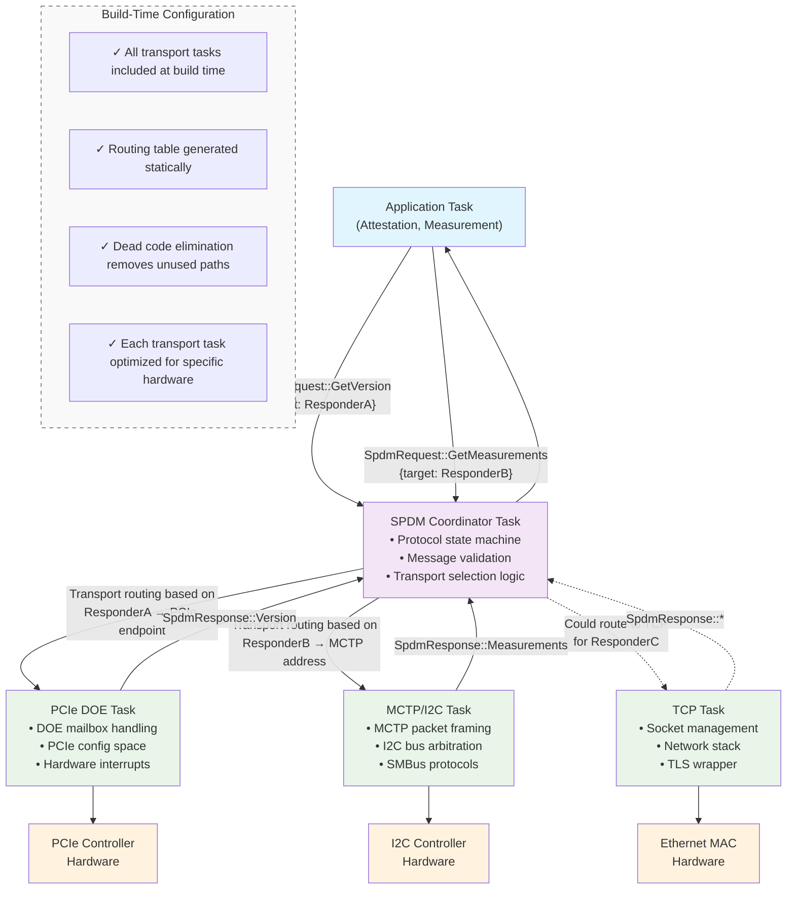

## Key Design Elements

Static Message Routing: The SPDM Coordinator task contains a compile-time routing table that maps SPDM responders to their appropriate transport tasks. No runtime polymorphism needed.
Transport Specialization: Each transport task is highly optimized for its specific protocol and hardware. The PCIe task knows about DOE mailboxes, the MCTP task handles I2C bus arbitration, etc.
Message-Based Abstraction: The abstraction happens at the message boundary - all tasks speak the same SpdmRequest/SpdmResponse message format, but each transport implements it differently.
Build-Time Flexibility: You can include/exclude transport tasks at build time based on your hardware. If you don't need TCP transport, it gets compiled out entirely.

