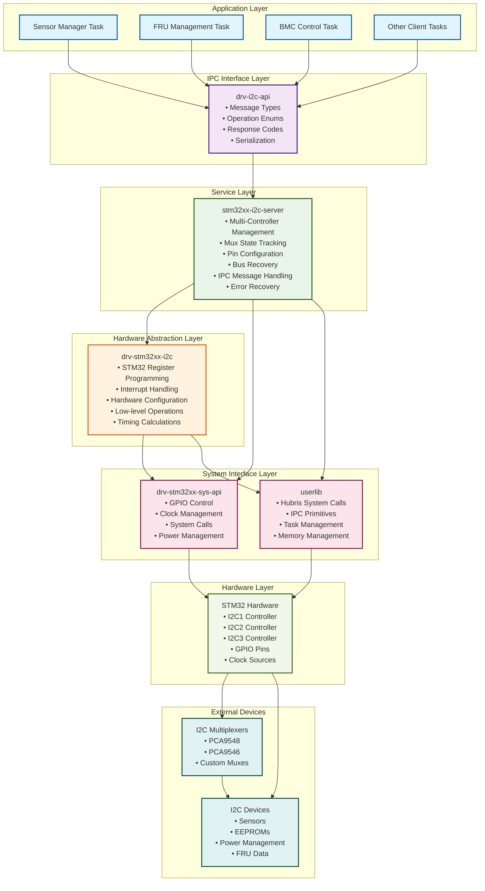
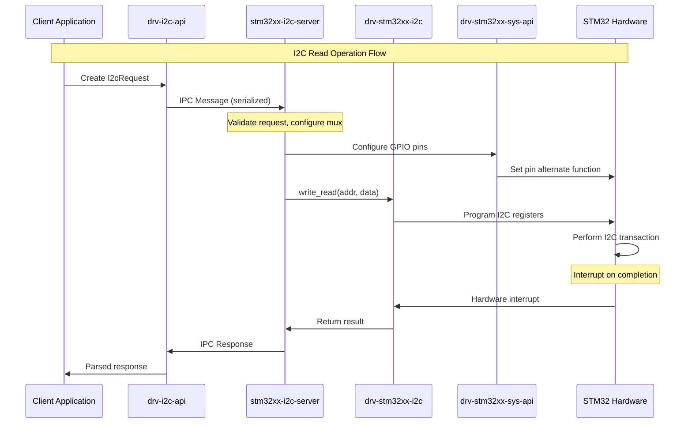
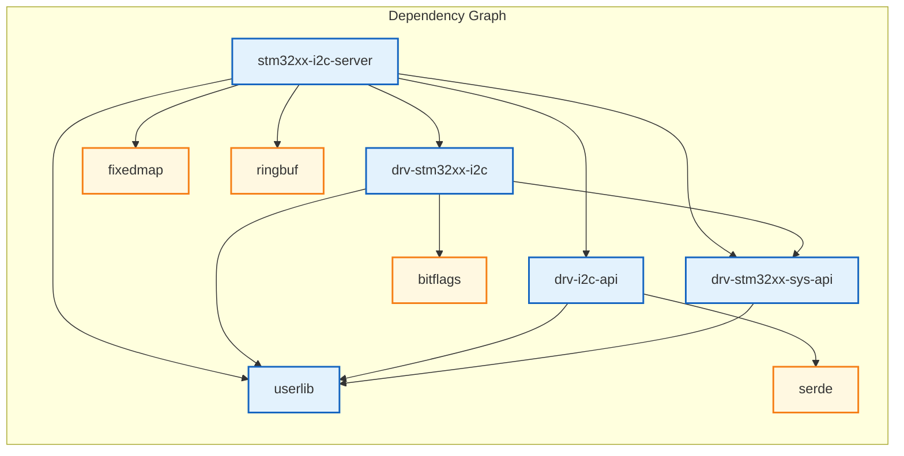
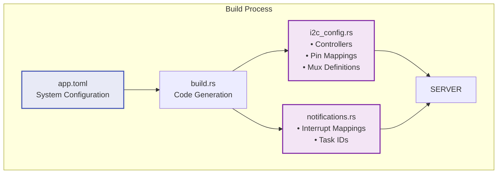
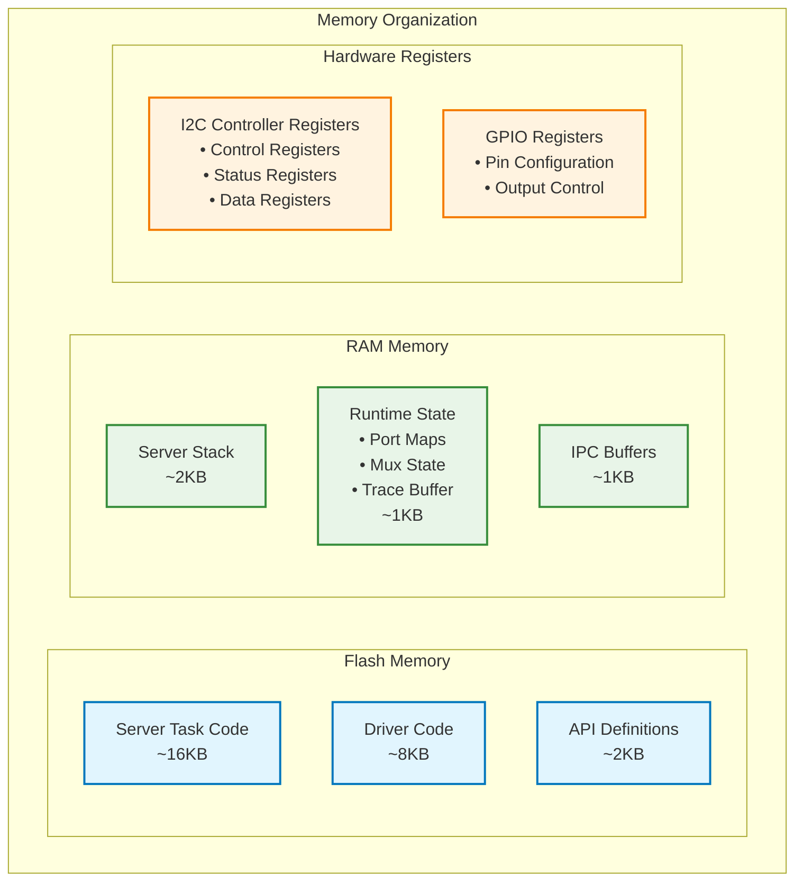
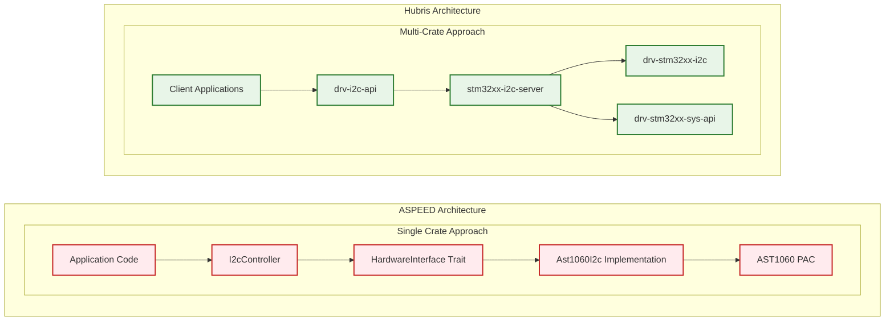

# STM32 I2C Driver Architecture - Crate Partitioning

**Project:** Hubris Operating System  
**Component:** STM32 I2C Driver Architecture  
**Version:** 1.0  
**Date:** September 8, 2025  

## Overview

This document illustrates the crate partitioning and layered architecture of the STM32 I2C driver implementation in Hubris, showing the separation of concerns across different crates and their relationships.

## Architecture Block Diagram



## Crate Responsibilities

### **Application Layer**
Applications that need I2C functionality communicate through the standardized IPC interface.

### **drv-i2c-api**
**Type:** Interface Definition Crate  
**Purpose:** Defines the IPC contract between clients and the I2C server
```rust
// Message types for IPC communication
pub struct I2cRequest {
    pub controller: Controller,
    pub operation: I2cOperation,
    pub timeout_ms: u32,
}

pub enum I2cOperation {
    WriteRead { addr: u8, write_data: Vec<u8>, read_len: u8 },
    // ... other operations
}
```

### **stm32xx-i2c-server**
**Type:** Server Task Crate (Binary)  
**Purpose:** High-level I2C system service with advanced features
```rust
// Main server loop handling IPC requests
#[export_name = "main"]
fn main() -> ! {
    // Multi-controller initialization
    // Mux state management
    // Complex error recovery
    // IPC message processing
}
```

### **drv-stm32xx-i2c**
**Type:** Hardware Driver Crate (Library)  
**Purpose:** Low-level STM32 I2C peripheral driver
```rust
// Direct hardware register programming
impl I2cController {
    pub fn write_read(&mut self, addr: u8, ...) -> Result<(), ResponseCode> {
        // STM32-specific register operations
        self.registers.cr2.write(|w| /* ... */);
    }
}
```

### **drv-stm32xx-sys-api**
**Type:** System Interface Crate  
**Purpose:** STM32-specific system operations (GPIO, clocks, etc.)
```rust
// GPIO control for pin muxing and bus recovery
impl Sys {
    pub fn gpio_configure_alternate(&self, pin: PinSet, ...) { }
    pub fn gpio_reset(&self, pin: PinSet) { }
}
```

### **userlib**
**Type:** Hubris System Library  
**Purpose:** Core Hubris system calls and IPC primitives
```rust
// IPC and system call interface
pub fn recv_without_notification<T>(
    buffer: &mut [u8],
    handler: impl FnOnce(Op, Message) -> Result<T, ResponseCode>
) -> T
```

## Data Flow Diagram



## Crate Dependencies



## Build-Time Configuration



## Memory Layout



## Comparison with ASPEED Architecture



## Key Architectural Benefits

### **Separation of Concerns**
- **API Layer**: Clean IPC interface definition
- **Service Layer**: High-level system management
- **Driver Layer**: Hardware-specific implementation
- **System Layer**: Platform services

### **Modularity**
- Each crate has a single, well-defined responsibility
- Clear dependency relationships
- Testable components in isolation

### **Safety & Security**
- Server task isolation prevents direct hardware access
- IPC-based communication with validation
- Controlled resource access through system APIs

### **Maintainability**
- Hardware changes isolated to driver crate
- API changes don't affect hardware implementation
- Server logic separate from low-level details

### **Scalability**
- Multiple controllers managed centrally
- Complex mux topologies supported
- System-wide coordination of I2C resources

This architecture represents a **production-grade embedded system design** where reliability, maintainability, and security are prioritized over simplicity, contrasting with the more direct ASPEED trait-based approach that prioritizes ease of use and portability.
