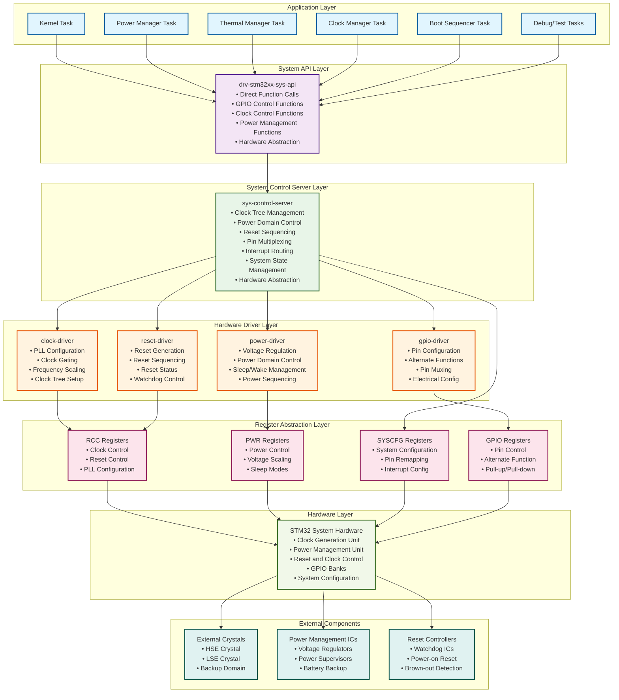
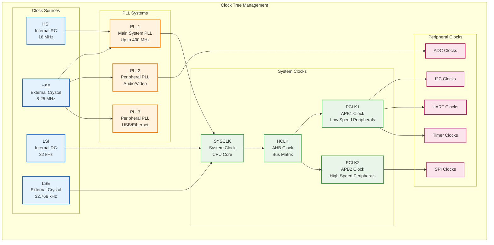
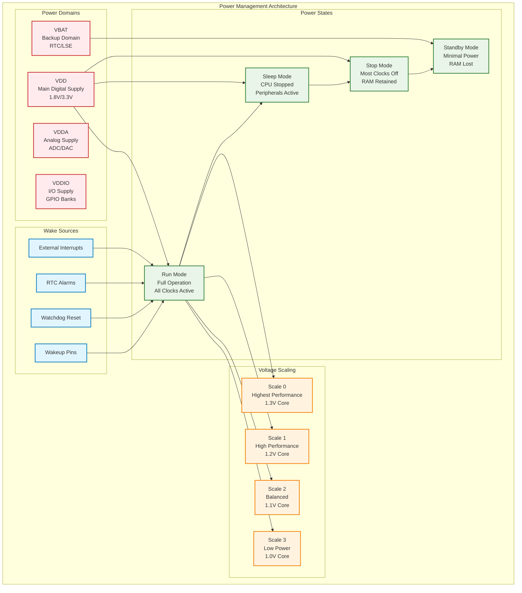
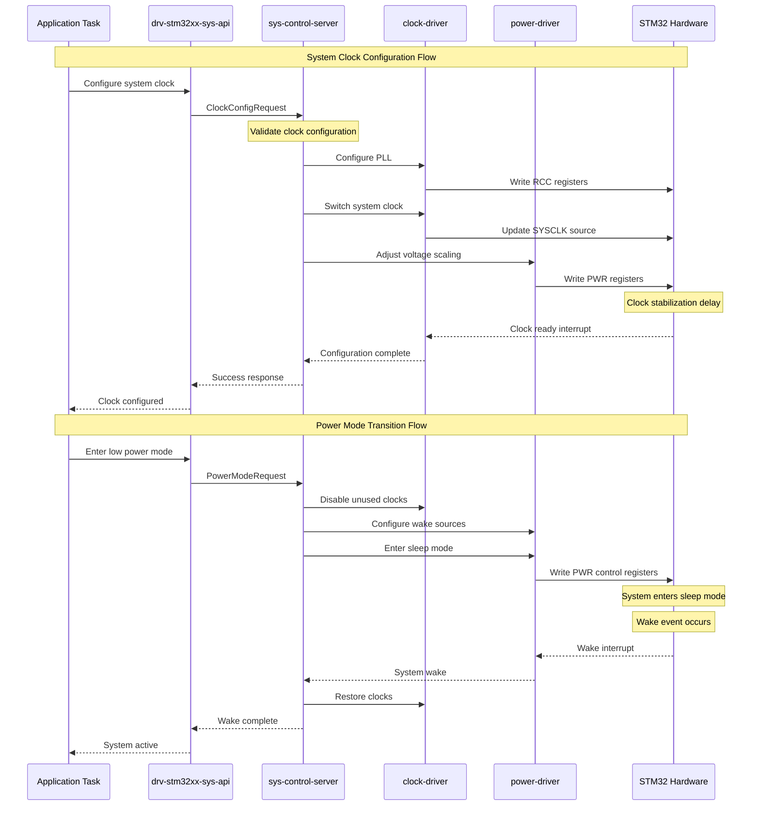
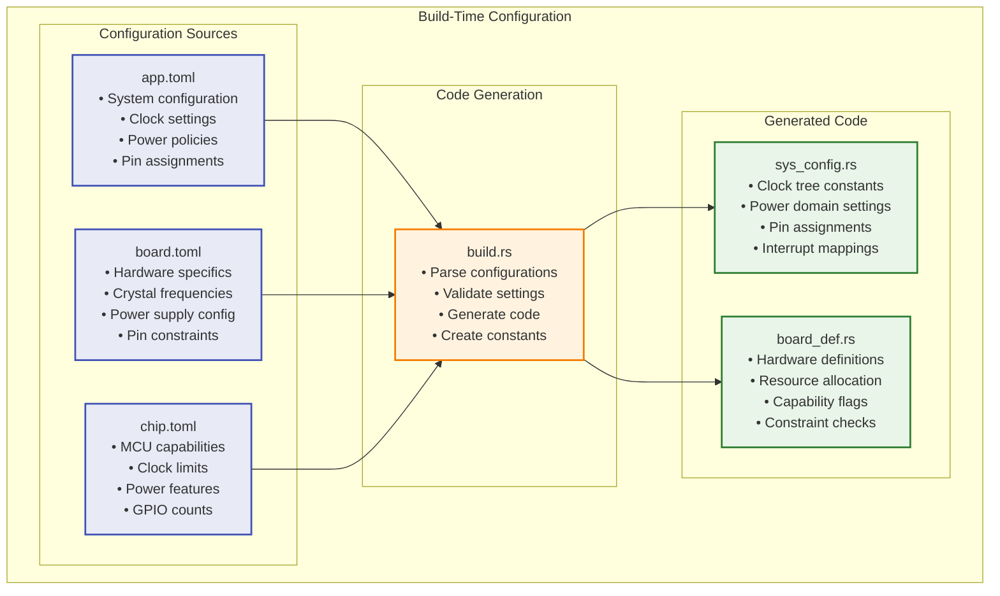
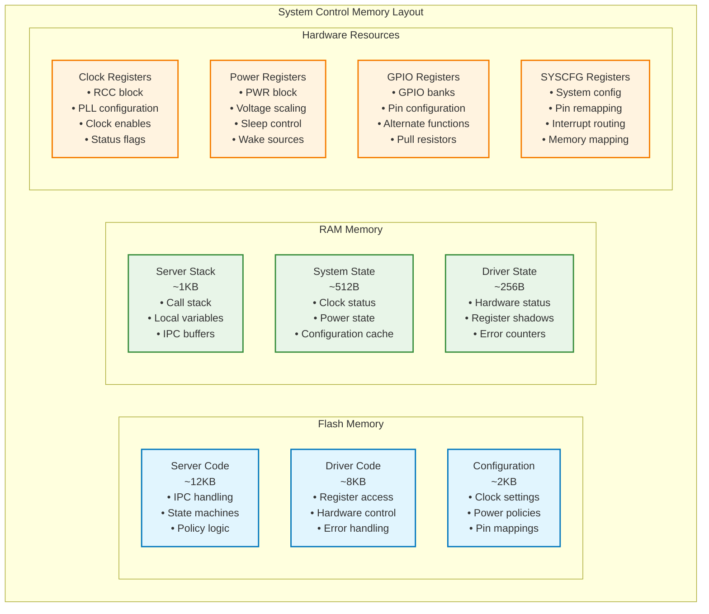
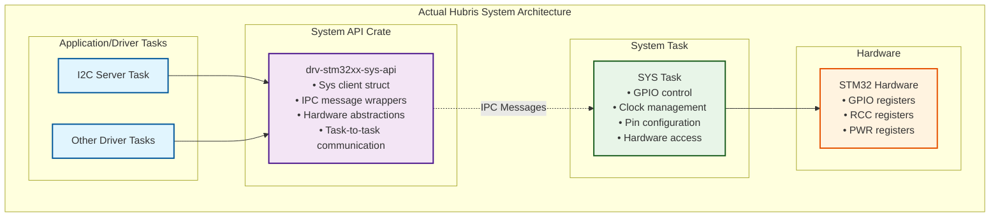

# Hubris System Control Driver Architecture

**Project:** Hubris Operating System  
**Component:** System Control Driver Architecture  
**Version:** 1.0  
**Date:** September 8, 2025  

## Overview

This document illustrates the architecture of a Hubris system control driver, responsible for managing system-level functions including clock control, power management, reset sequencing, and hardware configuration. The system control driver serves as the central authority for low-level system operations.

## System Control Architecture Block Diagram



## Clock Management Subsystem



## Power Management Subsystem



## System Control Data Flow



## System Control Crate Structure

```mermaid
graph TB
    subgraph "Crate Organization"
        subgraph "API Crate"
            SYSAPI_CRATE[drv-stm32xx-sys-api<br/>• System call wrappers<br/>• Hardware abstractions<br/>• Type definitions<br/>• Direct function calls<br/>• No IPC messages]
        end
        
        subgraph "Server Crate"
            SERVER_CRATE[sys-control-server<br/>• main() function<br/>• IPC handling<br/>• State management<br/>• Coordination logic<br/>• Policy enforcement]
        end
        
        subgraph "Driver Crates"
            CLK_CRATE[clock-driver<br/>• PLL management<br/>• Clock tree control<br/>• Frequency calculation<br/>• Clock gating]
            PWR_CRATE[power-driver<br/>• Voltage scaling<br/>• Power mode control<br/>• Wake source config<br/>• Power sequencing]
            GPIO_CRATE[gpio-driver<br/>• Pin configuration<br/>• Alternate functions<br/>• Pin muxing<br/>• Electrical settings]
        end
        
        subgraph "HAL Crate"
            HAL_CRATE[stm32-hal<br/>• Register definitions<br/>• Register access<br/>• Hardware abstraction<br/>• Device specifics]
        end
    end

    SYSAPI_CRATE --> SERVER_CRATE
    SERVER_CRATE --> CLK_CRATE
    SERVER_CRATE --> PWR_CRATE
    SERVER_CRATE --> GPIO_CRATE
    CLK_CRATE --> HAL_CRATE
    PWR_CRATE --> HAL_CRATE
    GPIO_CRATE --> HAL_CRATE

    classDef apiCrate fill:#f3e5f5,stroke:#7b1fa2,stroke-width:2px
    classDef serverCrate fill:#e8f5e8,stroke:#2e7d32,stroke-width:2px
    classDef driverCrate fill:#fff3e0,stroke:#f57c00,stroke-width:2px
    classDef halCrate fill:#e1f5fe,stroke:#0277bd,stroke-width:2px

    class SYSAPI_CRATE apiCrate
    class SERVER_CRATE serverCrate
    class CLK_CRATE,PWR_CRATE,GPIO_CRATE driverCrate
    class HAL_CRATE halCrate
```

## Configuration and Build System



## Memory and Resource Management



## Key System Control Features

### **Clock Management**
- **PLL Configuration**: Multiple PLLs for different subsystems
- **Clock Tree Control**: Hierarchical clock distribution
- **Dynamic Frequency Scaling**: Runtime frequency adjustment
- **Clock Gating**: Power optimization through selective clock disable

### **Power Management**
- **Voltage Scaling**: Dynamic voltage adjustment for performance/power trade-off
- **Sleep Modes**: Multiple low-power states with different wake latencies
- **Power Domain Control**: Independent control of power islands
- **Wake Source Management**: Configurable wake-up triggers

### **GPIO and Pin Control**
- **Pin Multiplexing**: Dynamic alternate function assignment
- **Electrical Configuration**: Drive strength, pull-up/down, speed settings
- **Pin Remapping**: Software-configurable pin assignments
- **Interrupt Configuration**: External interrupt source management

### **Reset and System Control**
- **Reset Generation**: Software and hardware reset control
- **Reset Sequencing**: Ordered reset of subsystems
- **Watchdog Management**: System reliability through watchdog timers
- **System Configuration**: Memory mapping and system feature control

## Architectural Benefits

### **Centralized Control**
- **Single Authority**: One server manages all system-level resources
- **Coordination**: Prevents conflicts between subsystem configurations
- **Policy Enforcement**: Consistent application of power and clock policies

### **Safety and Security**
- **Controlled Access**: All system control goes through validated server
- **Resource Protection**: Prevents unauthorized hardware reconfiguration
- **State Validation**: Ensures system remains in valid configurations

### **Flexibility and Maintainability**
- **Modular Design**: Separate drivers for different subsystems
- **Configuration-Driven**: Build-time configuration for different targets
- **Extensible**: Easy to add new power states or clock configurations

This system control architecture provides **comprehensive management of critical system resources** while maintaining the security, determinism, and reliability characteristics essential for mission-critical embedded systems.

## System API Architecture Clarification

### **Important: This IS IPC - Task-to-task communication**

The `drv-stm32xx-sys-api` crate uses **IPC for task-to-task communication** to access system hardware services.

```rust
// From the actual I2C server code:
use drv_stm32xx_sys_api::{Sys, PinSet, OutputType, Speed, Pull};

// Gets a task ID - this is talking to another task via IPC
let sys = SYS.get_task_id();
let sys = Sys::from(sys);

// These function calls hide IPC messages underneath
sys.gpio_configure_alternate(pin, OutputType::OpenDrain, Speed::Low, Pull::None, function);
sys.gpio_set(scl_pin);
sys.gpio_reset(scl_pin);
```

### **What this ACTUALLY is:**

Looking at the pattern `SYS.get_task_id()`, this proves:

1. **SYS** is a **task slot** (like `I2C_SERVER`)
2. **Sys::from(task_id)** creates an **IPC client** 
3. **gpio_configure_alternate()** etc. are **IPC calls** wrapped as function calls

### **Corrected Architecture Pattern:**



### **Likely Implementation Pattern:**

```rust
// drv-stm32xx-sys-api probably works like this:
pub struct Sys {
    task_id: TaskId,  // The SYS task ID
}

impl Sys {
    pub fn from(task_id: TaskId) -> Self {
        Self { task_id }
    }
    
    /// Send IPC message to SYS task for GPIO configuration
    pub fn gpio_configure_alternate(&self, pin: PinSet, ...) {
        let request = GpioConfigRequest {
            pin,
            mode: AlternateFunction,
            output_type: OpenDrain,
            // ...
        };
        
        // This is likely an IPC send to the SYS task
        let response = sys::send(self.task_id, &request);
        // Handle response...
    }
    
    /// Send IPC message to SYS task for GPIO control
    pub fn gpio_set(&self, pin: PinSet) {
        let request = GpioSetRequest { pin };
        sys::send(self.task_id, &request);
    }
}
```

### **Key Pattern Recognition:**

| Aspect | `drv-i2c-api` (Client-Server IPC) | `drv-stm32xx-sys-api` (System Service IPC) |
|--------|----------------------------------|---------------------------------------------|
| **Pattern** | `I2C_SERVER.get_task_id()` | `SYS.get_task_id()` |
| **Client Creation** | Client for I2C operations | Client for system operations |
| **Message Types** | I2C read/write requests | GPIO/clock/power requests |
| **Server Task** | I2C server task | SYS server task |
| **Purpose** | Peripheral communication | System resource management |

### **Both are IPC - Different Purposes:**

- **`drv-i2c-api`**: Application tasks → I2C server → Hardware peripherals
- **`drv-stm32xx-sys-api`**: Driver tasks → SYS server → System hardware

### **Conclusion:**

The `drv-stm32xx-sys-api` is **also IPC**, just like `drv-i2c-api`. The key insight is that `SYS.get_task_id()` indicates there's a **system server task** that manages GPIO, clocks, and power - similar to how there's an I2C server task for I2C operations.

This maintains Hubris's principle of **controlled hardware access** through dedicated server tasks rather than direct kernel system calls.
